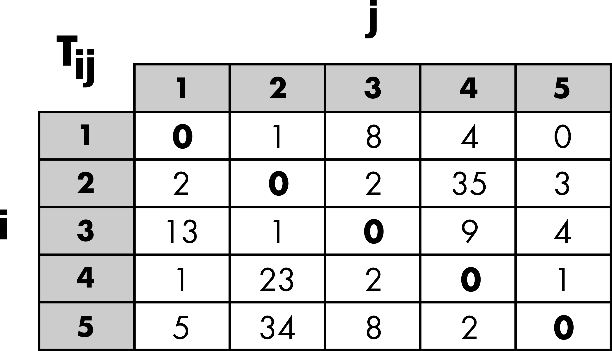
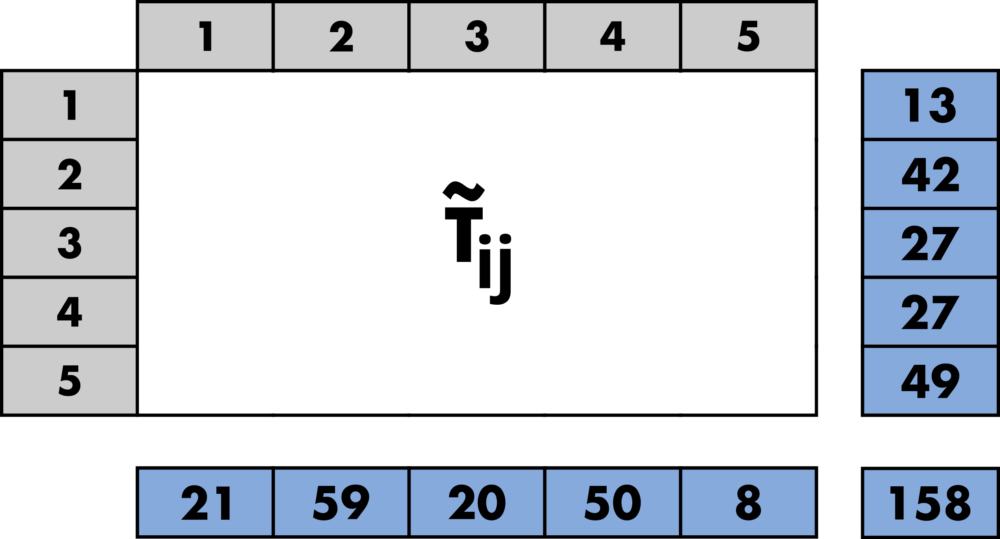
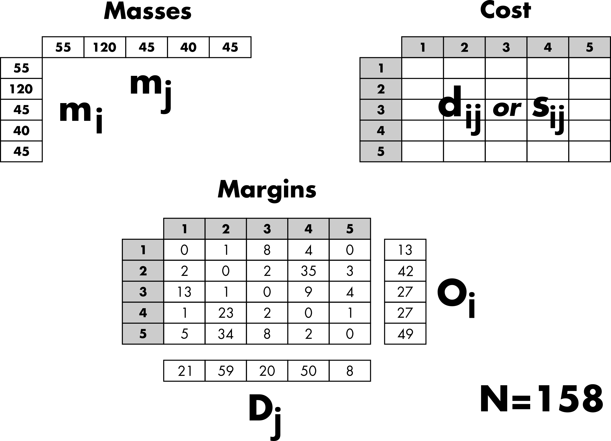
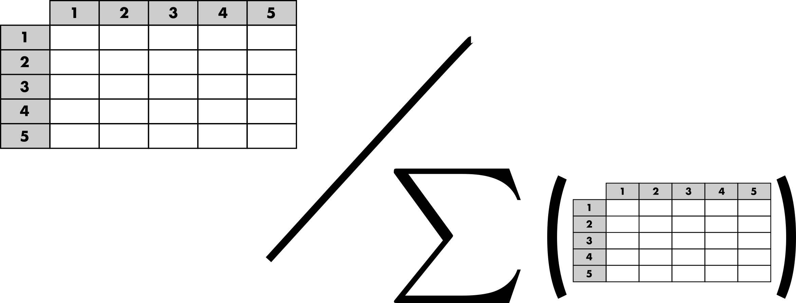
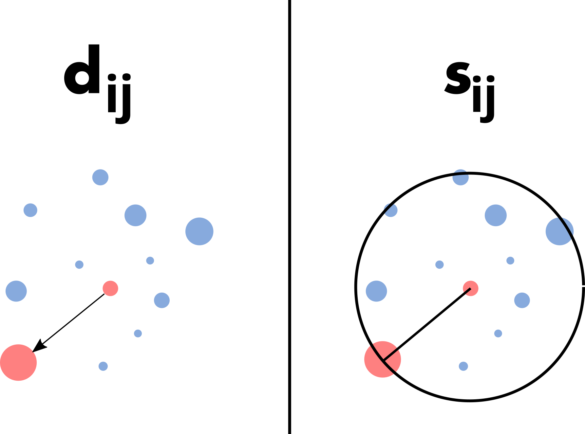
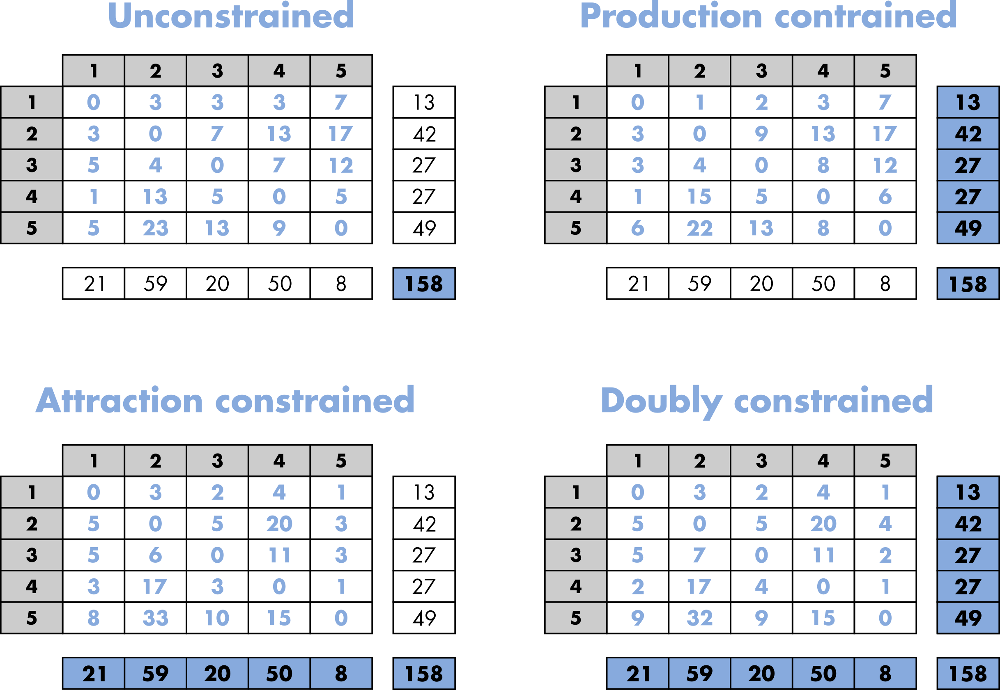
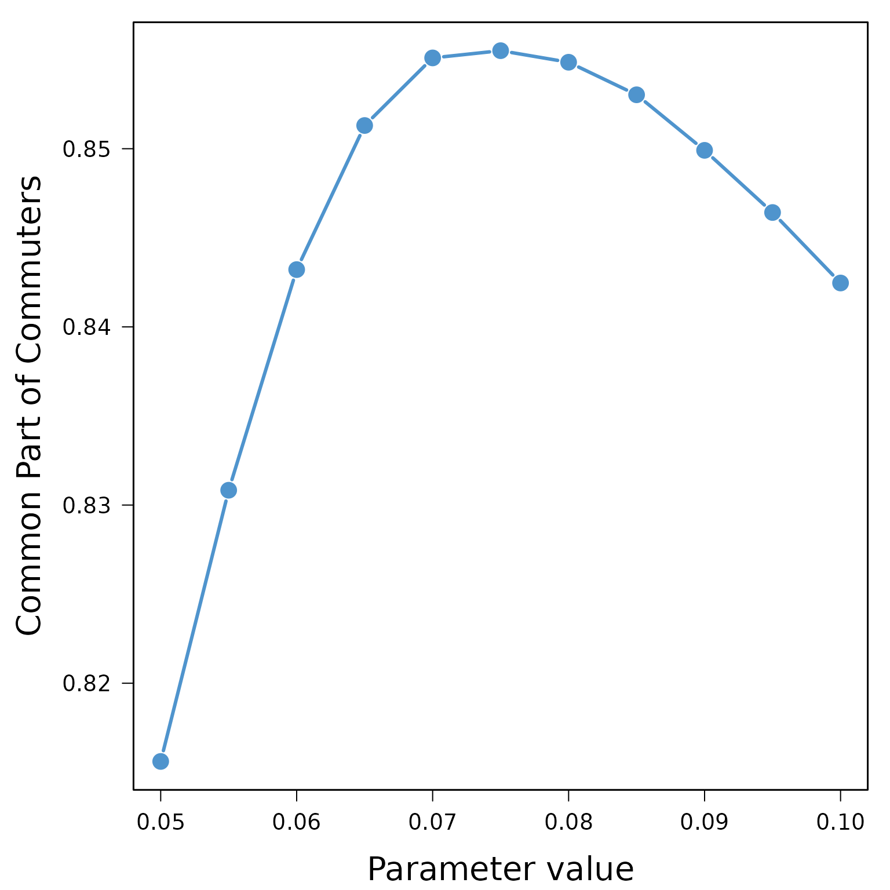

# Tutorial for TDLM

## Introduction

This tutorial aims to describe the different features of the R package
`TDLM`. The main purpose of the `TDLM` package is to provide a rigorous
framework for fairly comparing trip distribution laws and models
(Lenormand *et al.*, 2016). This general framework is based on a
two-step approach for generating mobility flows by separating the trip
distribution law, such as gravity or intervening opportunities, from the
modeling approach used to generate flows from this law.

## A short note on terminology

This framework is part of the four-step travel model. It corresponds to
the second step, called trip distribution, which aims to match trip
origins with trip destinations. The model used to generate trips or
flows, and more generally the degree of interaction between locations,
is often referred to as a spatial interaction model. Depending on the
research area, a matrix or a network formalism may be used to describe
these spatial interactions. Origin-Destination matrices (or trip tables)
are common in geography or transportation, while in statistical physics
or complex systems studies, the term mobility networks is usually
preferred.

## Origin–Destination matrix

The description of movements within a given area is represented by an
Origin-Destination (OD) matrix. The area of interest is divided into $n$
locations, and $T_{ij}$ represents the volume of flows between location
$i$ and location $j$. This volume typically corresponds to the number of
trips or a commuting flow (i.e., the number of individuals living in $i$
and working in $j$). The OD matrix is square, contains only positive
values, and may have a zero diagonal (Figure 1).

  



  

**Figure 1: Schematic representation of an Origin-Destination matrix.**

  

The goal is to generate a simulated OD matrix,
$\widetilde{T} = \left( {\widetilde{T}}_{ij} \right)$, using only
aggregated data while satisfying a set of constraints (Figure 2).

  



  

**Figure 2: Illustration of a simulated Origin-Destination (OD)
matrix.**

  

## Aggregated inputs information

Three categories of inputs are typically considered to simulate an OD
matrix (Figure 3). The masses and distances are the primary ingredients
used to generate a matrix of probabilities based on a given distribution
law. Thus, the probability $p_{ij}$ of observing a trip from location
$i$ to location $j$ depends on the masses, the demand at the origin
($m_{i}$), and the offer at the destination ($m_{j}$). Typically,
population is used as a surrogate for demand and offer. The probability
of movement also depends on the costs, which are based on the distance
$d_{ij}$ between locations or the number of opportunities $s_{ij}$
between locations, depending on the chosen law (more details are
provided in the next “Trip distribution laws” section). In general, the
effect of the cost can be adjusted with a parameter.

The margins are used to generate an OD matrix from the matrix of
probabilities while preserving the total number of trips ($N$), the
number of outgoing trips ($O_{i}$), and/or the number of incoming trips
($D_{j}$) (more details are provided in the “Constrained distribution
models” section).

  



  

**Figure 3: Schematic representation of the aggregated inputs
information.**

  

## Trip distribution laws

The purpose of a trip distribution law is to estimate the probability
$p_{ij}$ that, out of all the possible travels in the system, there is
one between location $i$ and location $j$. This probability is
asymmetric in $i$ and $j$, as are the flows themselves. It takes the
form of a square matrix of probabilities. This probability is normalized
across all possible pairs of origins and destinations, such that
$\sum_{i,j = 1}^{n}p_{ij} = 1$. Therefore, a matrix of probabilities can
be obtained by normalizing any OD matrix (Figure 4).

  



  

**Figure 4: Schematic representation of the matrix of probabilities.**

  

As mentioned in the previous section, most trip distribution laws depend
on the demand at the origin ($m_{i}$), the offer at the destination
($m_{j}$), and a cost to move from $i$ to $j$. There are two major
approaches for estimating the probability matrix. The traditional
gravity approach, in analogy with Newton’s law of gravitation, is based
on the assumption that the amount of trips between two locations is
related to their populations and decays according to a function of the
distance $d_{ij}$ between locations. In contrast to the gravity law, the
laws of intervening opportunities hinge on the assumption that the
number of opportunities $s_{ij}$ between locations plays a more
important role than the distance (Lenormand *et al.*, 2016). This
fundamental difference between the two schools of thought is illustrated
in Figure 5.

  



  

**Figure 5: Illustration of the fundamental difference between gravity
and intervening opportunity laws.**

  

It is important to note that the effect of the cost between locations
(distance or number of opportunities) can usually be adjusted with a
parameter, which can be calibrated automatically or by comparing the
simulated matrix with observed data.

## Constrained distribution models

The purpose of the trip distribution models is to generate an OD matrix
$\widetilde{T} = \left( {\widetilde{T}}_{ij} \right)$ by drawing at
random $N$ trips from the trip distribution law
$\left( p_{ij} \right)_{1 \leq i,j \leq n}$ respecting different level
of constraints according to the model. We considered four different
types of models in this package. As can be observed in Figure 6, the
four models respect different level of constraints from the total number
of trips to the total number of out-going and in-coming trips by
locations (i.e. the margins).

  



  

**Figure 6: Schematic representation of the constrained distribution
models.**

  

More specifically, the volume of flows ${\widetilde{T}}_{ij}$ is
generated from the matrix of probability with multinomial random draws
that will take different forms according to the model used (Lenormand
*et al.*, 2016). Therefore, since the process is stochastic, each
simulated matrix is unique and composed of integers. Note that it is
also possible to generate an average matrix from the multinomial trials.

## Goodness-of-fit measures

Finally, the trip distribution laws can be calibrated, and both the trip
distribution laws and models can be evaluated by comparing a simulated
matrix $\widetilde{T}$ with the observed matrix $T$. These comparisons
rely on various goodness-of-fit measures, which may or may not account
for the distance between locations. These measures are described above.

### Common Part of Commuters (CPC)

$$CPC\left( T,\widetilde{T} \right) = \frac{2 \cdot \sum\limits_{i,j = 1}^{n}min\left( T_{ij},{\widetilde{T}}_{ij} \right)}{N + \widetilde{N}}$$

(Gargiulo *et al.*, 2012; Lenormand *et al.*, 2012, 2016)

### Normalized Root Mean Square Error (NRMSE)

$$NRMSE\left( T,\widetilde{T} \right) = \sqrt{\frac{\sum\limits_{i,j = 1}^{n}\left( T_{ij} - {\widetilde{T}}_{ij} \right)^{2}}{N}}$$

### Kullback–Leibler divergence (KS)

$$KL\left( T,\widetilde{T} \right) = \sum\limits_{i,j = 1}^{n}\frac{T_{ij}}{N}\log\left( \frac{T_{ij}}{N}\frac{\widetilde{N}}{{\widetilde{T}}_{ij}} \right)$$(Kullback
& Leibler, 1951)

### Common Part of Links (CPL)

$$CPL\left( T,\widetilde{T} \right) = \frac{2 \cdot \sum\limits_{i,j = 1}^{n}1_{T_{ij} > 0} \cdot 1_{{\widetilde{T}}_{ij} > 0}}{\sum\limits_{i,j = 1}^{n}1_{T_{ij} > 0} + \sum\limits_{i,j = 1}^{n}1_{{\widetilde{T}}_{ij} > 0}}$$(Lenormand
*et al.*, 2016)

### Common Part of Commuters based on the disance (CPC_d)

Let us consider $N_{k}$ (and ${\widetilde{N}}_{k}$) the sum of observed
(and simulated) flows at a distance comprised in the bin
$\lbrack\text{bin\_size} \cdot k - \text{bin\_size},\text{bin\_size} \cdot k\lbrack$.

$$CPC_{d}\left( T,\widetilde{T} \right) = \frac{2 \cdot \sum\limits_{k = 1}^{\infty}min\left( N_{k},{\widetilde{N}}_{k} \right)}{N + \widetilde{N}}$$

(Lenormand *et al.*, 2016)

### Kolmogorv-Smirnov statistic and p-value (KS).

These measures, described in Massey (1951), are based on the observed
and simulated flow distance distributions and are computed using the
[ks_test](https://hectorrdb.github.io/Ecume/reference/ks_test.html)
function from the [Ecume](https://cran.r-project.org/package=Ecume)
package.

------------------------------------------------------------------------

## Example of commuting in Kansas

### Data

In this example, we will use commuting data from US Kansas in 2000 to
illustrate  
the main functions of the package. The dataset comprises three tables
providing information on commuting flows between the 105 US Kansas
counties in 2000. The observed OD matrix
[od](https://rtdlm.github.io/TDLM/reference/od.html) is a zero-diagonal
square matrix of integers. Each element of the matrix represents the
number of commuters between a pair of US Kansas counties.

``` r
data(od)

od[1:5, 1:5]
```

    ##       20001 20003 20005 20007 20009
    ## 20001     0    71     0     0     0
    ## 20003   236     0     0     0     0
    ## 20005     0     0     0     0     0
    ## 20007     0     0     0     0     8
    ## 20009     0     0     0    11     0

``` r
dim(od)
```

    ## [1] 105 105

The aggregated data are composed of the
[distance](https://rtdlm.github.io/TDLM/reference/distance.html) matrix,

``` r
data(distance)

distance[1:5, 1:5]
```

    ##           20001     20003    20005    20007    20009
    ## 20001   0.00000  36.50943 182.9291 306.8503 308.8995
    ## 20003  36.50943   0.00000 146.4335 317.5593 303.2348
    ## 20005 182.92913 146.43350   0.0000 389.5330 319.5319
    ## 20007 306.85034 317.55926 389.5330   0.0000 139.0661
    ## 20009 308.89947 303.23478 319.5319 139.0661   0.0000

``` r
dim(distance)
```

    ## [1] 105 105

and the masses and margins contained in the data.frame
[mass](https://rtdlm.github.io/TDLM/reference/mass.html).

``` r
data(mass)

mass[1:10,]
```

    ##       Population Out_Commuters In_Commuters
    ## 20001      14385          1267         1343
    ## 20003       8110          1346          361
    ## 20005      16774          1065         1247
    ## 20007       5307           260          201
    ## 20009      28205          1129         1324
    ## 20011      15379           662          761
    ## 20013      10724          1148          984
    ## 20015      59482         14182         3579
    ## 20017       3030           681           93
    ## 20019       4359           486          180

``` r
dim(mass)
```

    ## [1] 105   3

``` r
mi <- as.numeric(mass[,1])
names(mi) <- rownames(mass)

mj <- mi

Oi <- as.numeric(mass[,2])
names(Oi) <- rownames(mass)

Dj <- as.numeric(mass[,3])
names(Dj) <- rownames(mass)
```

The data must always be based on the same number of locations sorted in
the same  
order. The function
[check_format_names](https://rtdlm.github.io/TDLM/reference/check_format_names.html)
can be used to verify the validity of all inputs before running the main
functions of the package.

``` r
check_format_names(vectors = list(mi = mi, mj = mj, Oi = Oi, Dj = Dj),
                   matrices = list(od = od, distance = distance),
                   check = "format_and_names")
```

    ## The inputs passed the format_and_names checks successfully!

Optional spatial information are also provided here.
[county](https://rtdlm.github.io/TDLM/reference/county.html) is a
spatial object containing the geometry of the 105 US Kansas counties in
2000.

``` r
library(sf)

data(county)

county[1:10,]
```

    ## Simple feature collection with 10 features and 4 fields
    ## Geometry type: MULTIPOLYGON
    ## Dimension:     XY
    ## Bounding box:  xmin: -99.0334 ymin: 36.99796 xmax: -94.6139 ymax: 40.0006
    ## Geodetic CRS:  WGS 84
    ##         ID Longitude Latitude     Area                       geometry
    ## 1016 20001 -95.30137 37.88581 1307.667 MULTIPOLYGON (((-95.08805 3...
    ## 983  20003 -95.29334 38.21429 1512.337 MULTIPOLYGON (((-95.07771 3...
    ## 869  20005 -95.31288 39.53194 1125.682 MULTIPOLYGON (((-95.56751 3...
    ## 1064 20007 -98.68482 37.22888 2941.524 MULTIPOLYGON (((-98.52686 3...
    ## 962  20009 -98.75650 38.47904 2330.541 MULTIPOLYGON (((-99.03239 3...
    ## 1017 20011 -94.84928 37.85522 1653.609 MULTIPOLYGON (((-94.61413 3...
    ## 843  20013 -95.56416 39.82657 1480.469 MULTIPOLYGON (((-95.77332 3...
    ## 1011 20015 -96.83911 37.78125 3744.168 MULTIPOLYGON (((-96.52571 3...
    ## 974  20017 -96.59395 38.30205 2013.697 MULTIPOLYGON (((-96.81972 3...
    ## 1079 20019 -96.24535 37.15007 1669.418 MULTIPOLYGON (((-96.52495 3...

``` r
plot(county)
```


[coords](https://rtdlm.github.io/TDLM/reference/coords.html) and
[coords_xy](https://rtdlm.github.io/TDLM/reference/coords_xy.html) are
two dataframes providing longitude/latitude and X/Y coordinates for each
location, respectively.

``` r
coords[1:10,]
```

    ##       Longitude Latitude
    ## 20001 -95.30137 37.88581
    ## 20003 -95.29334 38.21429
    ## 20005 -95.31288 39.53194
    ## 20007 -98.68482 37.22888
    ## 20009 -98.75650 38.47904
    ## 20011 -94.84928 37.85522
    ## 20013 -95.56416 39.82657
    ## 20015 -96.83911 37.78125
    ## 20017 -96.59395 38.30205
    ## 20019 -96.24535 37.15007

``` r
coords_xy[1:10,]
```

    ##               X       Y
    ## 20001 -10608899 4563329
    ## 20003 -10608005 4609773
    ## 20005 -10610183 4798171
    ## 20007 -10985547 4471108
    ## 20009 -10993524 4647367
    ## 20011 -10558574 4559025
    ## 20013 -10638154 4840804
    ## 20015 -10780080 4548659
    ## 20017 -10752789 4622229
    ## 20019 -10713984 4460066

### Extract Additional Spatial Information

The functions
[extract_distances](https://rtdlm.github.io/TDLM/reference/extract_distances.html),
[extract_opportunities](https://rtdlm.github.io/TDLM/reference/check_format_names.html),
and
[extract_spatial_information](https://rtdlm.github.io/TDLM/reference/extract_spatial_information.html)  
can be used to extract matrices of distances and the number of
intervening opportunities.

The first function computes distances in kilometers between pairs of
locations based on geographical coordinates. It can calculate either
great-circle distances, using longitude/latitude coordinates and the
Haversine formula

``` r
haversine_d <- extract_distances(coords = coords,
                                 method = "Haversine")
haversine_d[1:5, 1:5]
```

    ##           [,1]      [,2]     [,3]     [,4]     [,5]
    ## [1,]   0.00000  36.50943 182.9291 306.8503 308.8995
    ## [2,]  36.50943   0.00000 146.4335 317.5593 303.2348
    ## [3,] 182.92913 146.43350   0.0000 389.5330 319.5319
    ## [4,] 306.85034 317.55926 389.5330   0.0000 139.0661
    ## [5,] 308.89947 303.23478 319.5319 139.0661   0.0000

``` r
distance[1:5, 1:5]
```

    ##           20001     20003    20005    20007    20009
    ## 20001   0.00000  36.50943 182.9291 306.8503 308.8995
    ## 20003  36.50943   0.00000 146.4335 317.5593 303.2348
    ## 20005 182.92913 146.43350   0.0000 389.5330 319.5319
    ## 20007 306.85034 317.55926 389.5330   0.0000 139.0661
    ## 20009 308.89947 303.23478 319.5319 139.0661   0.0000

or Euclidean distances based on X/Y coordinates

``` r
xy_d <- extract_distances(coords = coords_xy,
                          method = "Euclidean")

oldmar <- par()$mar
par(mar = c(4.5, 6, 1, 1))
plot(haversine_d, xy_d, xlim=c(0,900), ylim=c(0,900),
     type="p", pch=16, cex=2, lty=1, lwd=3, 
     col="steelblue3", axes=FALSE, xlab="", ylab="")
axis(1, cex.axis=1.2)
axis(2, cex.axis=1.2, las=1)
mtext("Haversine (km)", 1, line = 3.25, cex = 1.75)
mtext("Euclidean (km)", 2, line = 4, cex = 1.75)
box(lwd=1.5)
```


``` r
par(mar = oldmar)
```

The second function computes the number of opportunities between pairs
of locations. For a given pair of locations, the number of opportunities
between the origin and the destination is based on the number of
opportunities within a circle of radius equal to the distance between
the origin and the destination, centered at the origin. The number of
opportunities at the origin and the destination are not included. In our
case, the number of inhabitants ($m_{i}$) is used as a proxy for the
number of opportunities.

``` r
sij <- extract_opportunities(opportunity = mi,
                             distance = distance,
                             check_names = TRUE)
sij[1:5, 1:5]
```

    ##         20001   20003   20005   20007   20009
    ## 20001       0   16997 1445725 2358187 2363494
    ## 20003       0       0 1374401 2403828 2354815
    ## 20005 1311224 1240896       0 2454129 2346302
    ## 20007 1433163 1481954 2489482       0  634786
    ## 20009 1778443 1651945 1820549  344665       0

The last function takes as input a spatial object containing the
geometry of the locations that can be handled by the
[sf](https://cran.r-project.org/package=sf) package. It returns a matrix
of great-circle distances between locations (expressed in km). An
optional `id`  
can also be provided to be used as names for the outputs.

``` r
spi <- extract_spatial_information(county, id = "ID")

sp_d <- spi$distance

sp_d[1:5, 1:5]
```

    ##              20001        20003       20005       20007       20009
    ## 20001 0.0000000000 0.0003285808 0.001646171 0.003446635 0.003505694
    ## 20003 0.0003285808 0.0000000000 0.001317793 0.003531738 0.003473271
    ## 20005 0.0016461705 0.0013177925 0.000000000 0.004083384 0.003600990
    ## 20007 0.0034466353 0.0035317381 0.004083384 0.000000000 0.001252210
    ## 20009 0.0035056940 0.0034732710 0.003600990 0.001252210 0.000000000

``` r
distance[1:5, 1:5]
```

    ##           20001     20003    20005    20007    20009
    ## 20001   0.00000  36.50943 182.9291 306.8503 308.8995
    ## 20003  36.50943   0.00000 146.4335 317.5593 303.2348
    ## 20005 182.92913 146.43350   0.0000 389.5330 319.5319
    ## 20007 306.85034 317.55926 389.5330   0.0000 139.0661
    ## 20009 308.89947 303.23478 319.5319 139.0661   0.0000

This function also allows extracting the surface area of each location
(in square kilometers), which can be useful to calibrate the trip
distribution  
laws’ parameter value (see below).

``` r
mean(spi$surface)
```

    ## [1] 2028.05

### Run functions

The main function of the package is
[run_law_model](https://rtdlm.github.io/TDLM/reference/run_law_model.html).
The function has two sets of arguments, one for the law and another one
for the model. The inputs (described above) necessary to run this
function depends on the law (either the matrix of distances or number of
opportunities can be used, or neither of them for the uniform law) and
on the model and its associated constraints (number of trips, out-going
trips and/or in-coming trips). The example below will generate three
simulated ODs with the normalized gravity law with an exponential
distance decay function (Lenormand *et al.*, 2016) and the Doubly
Constrained Model.

``` r
res <- run_law_model(law = "NGravExp", 
                     mass_origin = mi, 
                     mass_destination = mj, 
                     distance = distance, 
                     opportunity = NULL,
                     param = 0.01,
                     write_proba = TRUE,
                     
                     model = "DCM", 
                     nb_trips = NULL, 
                     out_trips = Oi, 
                     in_trips = Dj,
                     average = FALSE, 
                     nbrep = 3)
```

The output is an object of class `TDLM`. In this case it is a list of
matrices composed of the three simulated matrices (`replication_1`,
`replication_2` and `replication_3`), the matrix of probabilities
(called `proba`) associated with the law and returned only if
`write_proba = TRUE`. The objects of class `TDLM` contain a table `info`
summarizing the simulation run.

``` r
print(res)
```

    ##        Argument    Value
    ## 1           Law NGravExp
    ## 2         Model      DCM
    ## 3 #Replications        3
    ## 4   #Parameters        1
    ## 5     Parameter     0.01

``` r
str(res)
```

    ## List of 5
    ##  $ info         :'data.frame':   5 obs. of  2 variables:
    ##   ..$ Argument: chr [1:5] "Law" "Model" "#Replications" "#Parameters" ...
    ##   ..$ Value   : chr [1:5] "NGravExp" "DCM" "3" "1" ...
    ##  $ replication_1: num [1:105, 1:105] 0 24 4 0 2 16 5 102 5 6 ...
    ##   ..- attr(*, "dimnames")=List of 2
    ##  $ replication_2: num [1:105, 1:105] 0 24 4 1 2 16 5 101 5 7 ...
    ##   ..- attr(*, "dimnames")=List of 2
    ##  $ replication_3: num [1:105, 1:105] 0 23 5 1 3 16 4 101 5 6 ...
    ##   ..- attr(*, "dimnames")=List of 2
    ##  $ proba        : num [1:105, 1:105] 0.00 4.31e-05 2.16e-05 3.90e-06 1.81e-05 ...
    ##   ..- attr(*, "dimnames")=List of 2
    ##  - attr(*, "class")= chr [1:2] "TDLM" "list"
    ##  - attr(*, "from")= chr "run_law_model"
    ##  - attr(*, "proba")= logi TRUE

This simulation run was based on one parameter value. It is possible to
use a vector instead of a scalar for the `param` argument.

``` r
res <- run_law_model(law = "NGravExp", 
                     mass_origin = mi, 
                     mass_destination = mj, 
                     distance = distance, 
                     opportunity = NULL,
                     param = c(0.01,0.02),
                     write_proba = TRUE,
                     
                     model = "DCM", 
                     nb_trips = NULL, 
                     out_trips = Oi, 
                     in_trips = Dj,
                     average = FALSE, 
                     nbrep = 3)
```

In this case a list of list of matrices will be returned (one for each
parameter value).

``` r
print(res)
```

    ##        Argument    Value
    ## 1           Law NGravExp
    ## 2         Model      DCM
    ## 3 #Replications        3
    ## 4   #Parameters        2
    ## 5   Parameter 1     0.01
    ## 6   Parameter 2     0.02

``` r
str(res)
```

    ## List of 3
    ##  $ info       :'data.frame': 6 obs. of  2 variables:
    ##   ..$ Argument: chr [1:6] "Law" "Model" "#Replications" "#Parameters" ...
    ##   ..$ Value   : chr [1:6] "NGravExp" "DCM" "3" "2" ...
    ##  $ parameter_1:List of 4
    ##   ..$ replication_1: num [1:105, 1:105] 0 23 5 0 2 16 4 101 7 7 ...
    ##   .. ..- attr(*, "dimnames")=List of 2
    ##   ..$ replication_2: num [1:105, 1:105] 0 24 4 0 2 16 5 101 6 6 ...
    ##   .. ..- attr(*, "dimnames")=List of 2
    ##   ..$ replication_3: num [1:105, 1:105] 0 24 4 0 3 15 4 101 5 7 ...
    ##   .. ..- attr(*, "dimnames")=List of 2
    ##   ..$ proba        : num [1:105, 1:105] 0.00 4.31e-05 2.16e-05 3.90e-06 1.81e-05 ...
    ##   .. ..- attr(*, "dimnames")=List of 2
    ##  $ parameter_2:List of 4
    ##   ..$ replication_1: num [1:105, 1:105] 0 55 2 0 0 39 1 76 7 7 ...
    ##   .. ..- attr(*, "dimnames")=List of 2
    ##   ..$ replication_2: num [1:105, 1:105] 0 53 2 0 0 39 1 77 5 8 ...
    ##   .. ..- attr(*, "dimnames")=List of 2
    ##   ..$ replication_3: num [1:105, 1:105] 0 55 2 0 0 42 1 76 5 8 ...
    ##   .. ..- attr(*, "dimnames")=List of 2
    ##   ..$ proba        : num [1:105, 1:105] 0.00 8.13e-05 8.17e-06 7.10e-07 3.16e-06 ...
    ##   .. ..- attr(*, "dimnames")=List of 2
    ##  - attr(*, "class")= chr [1:2] "TDLM" "list"
    ##  - attr(*, "from")= chr "run_law_model"
    ##  - attr(*, "proba")= logi TRUE

It is also important to note that the radiation law and the uniform law
are free of parameter.

``` r
res <- run_law_model(law = "Rad", 
                     mass_origin = mi, 
                     mass_destination = mj, 
                     distance = NULL, 
                     opportunity = sij,
                     param = NULL,
                     write_proba = TRUE,
                     
                     model = "DCM", 
                     nb_trips = NULL, 
                     out_trips = Oi, 
                     in_trips = Dj,
                     average = FALSE, 
                     nbrep = 3)

print(res)
```

    ##        Argument Value
    ## 1           Law   Rad
    ## 2         Model   DCM
    ## 3 #Replications     3

The argument `average` can be used to generate an average matrix based
on a multinomial distribution (based on an infinite number of drawings).
In this case, the models’ inputs can be either positive integer or real
numbers and the output (`nbrep = 1` in this case) will be a matrix of
positive real numbers.

``` r
res$replication_1[1:10,1:10]
```

    ##       [,1] [,2] [,3] [,4] [,5] [,6] [,7] [,8] [,9] [,10]
    ##  [1,]    0   32    0    0    0  122    0    1    0     0
    ##  [2,]  570    0    0    0    0   23    0    0    0     0
    ##  [3,]    0    0    0    0    0    0  197    0    0     0
    ##  [4,]    0    0    0    0    0    0    0    0    0     0
    ##  [5,]    0    0    0    1    0    0    0    5    0     0
    ##  [6,]   17    2    0    0    0    0    0    0    0     0
    ##  [7,]    0    0  203    0    0    0    0    0    0     0
    ##  [8,]    4    1    1    1   10    5    1    0    0     1
    ##  [9,]    0    0    0    0    0    0    0   40    0     0
    ## [10,]    0    0    0    0    0    0    0   13    0     0

``` r
res <- run_law_model(law = "Rad", 
                     mass_origin = mi, 
                     mass_destination = mj, 
                     distance = NULL, 
                     opportunity = sij,
                     param = NULL,
                     write_proba = TRUE,
                     
                     model = "DCM", 
                     nb_trips = NULL, 
                     out_trips = Oi, 
                     in_trips = Dj,
                     average = TRUE, 
                     nbrep = 3)

print(res)
```

    ##        Argument       Value
    ## 1           Law         Rad
    ## 2         Model         DCM
    ## 3 #Replications 1 (average)

``` r
res$replication_1[1:10,1:10]
```

    ##               [,1]         [,2]         [,3]        [,4]        [,5]
    ##  [1,] 0.000000e+00 32.489126787 1.629984e-01 0.016920996  0.15237245
    ##  [2,] 5.645502e+02  0.000000000 1.486179e-01 0.013393029  0.12620728
    ##  [3,] 8.174149e-02  0.029271193 0.000000e+00 0.018056330  0.17854030
    ##  [4,] 5.866238e-03  0.001762770 5.461868e-03 0.000000000  0.19842557
    ##  [5,] 7.824946e-02  0.029022462 2.083666e-01 1.384128388  0.00000000
    ##  [6,] 1.794521e+01  2.896771667 1.227318e-01 0.011821651  0.10645318
    ##  [7,] 4.854541e-02  0.018250753 2.003670e+02 0.012115619  0.12401359
    ##  [8,] 4.235292e+00  1.150831358 1.817300e+00 1.595238584 10.87001938
    ##  [9,] 1.701865e-02  0.006442393 1.358024e-02 0.002770548  0.02718142
    ## [10,] 3.657435e-01  0.009929222 1.029942e-02 0.007826564  0.02624540
    ##               [,6]         [,7]       [,8]         [,9]       [,10]
    ##  [1,] 1.206594e+02 8.830116e-02  1.6373050 0.0120699118 0.077792287
    ##  [2,] 2.261364e+01 1.297314e-01  0.8622905 0.0050699515 0.006066701
    ##  [3,] 1.934136e-01 1.973629e+02  0.9187253 0.0061615137 0.005316496
    ##  [4,] 9.469381e-03 6.169585e-03  0.2781562 0.0008433071 0.001289290
    ##  [5,] 1.033250e-01 2.460361e-01  3.4622997 0.0158170269 0.015048768
    ##  [6,] 0.000000e+00 1.180103e-01  0.7525006 0.0038974802 0.009213094
    ##  [7,] 1.138615e-01 0.000000e+00  0.6335424 0.0040870204 0.002103181
    ##  [8,] 5.040595e+00 1.982887e+00  0.0000000 0.7993856049 1.037050097
    ##  [9,] 2.296632e-02 1.230878e-02 39.0494340 0.0000000000 0.001547053
    ## [10,] 6.732291e-02 1.102091e-02 13.9879613 0.0025478617 0.000000000

The functions
[run_law](https://rtdlm.github.io/TDLM/reference/run_law.html) and
[run_model](https://rtdlm.github.io/TDLM/reference/run_model.html) have
been designed to run only one of the two components of the two-step
approach. They function the same as a
[run_law_model](https://rtdlm.github.io/TDLM/reference/run_law_model.html),
but it is worth noting that only inter-location flows are considered for
the distribution laws, meaning that the matrix of probabilities (and
associated simulated OD matrices) generated by a given distribution law
with
[run_law_model](https://rtdlm.github.io/TDLM/reference/run_law_model.html)
or [run_law](https://rtdlm.github.io/TDLM/reference/run_law.html) is a
zero-diagonal matrix. Nevertheless, it is possible to generate
intra-location flows with
[run_model](https://rtdlm.github.io/TDLM/reference/run_model.html)
taking any kind of matrix of probabilities as input.

### Parameters’ calibration & models’ evaluation

The package contains two function to help calibrating and evaluating the
model. The function
[gof](https://rtdlm.github.io/TDLM/reference/gof.html) computes
goodness-of-fit measures between observed and simulated OD matrices and
the function
[calib_param](https://rtdlm.github.io/TDLM/reference/calib_param.html)
that estimates the optimal parameter value for a given law and a given
spatial distribution of location based on the Figure 8 in (Lenormand *et
al.*, 2016).

Let us illustrate the trip distribution laws and models’ calibration
with the the normalized gravity law with an exponential distance decay
function and the Doubly Constrained Model. Based on the average surface
area of the Kansas counties (in square kilometers) it seems that the
optimal parameter value of the normalized gravity law with an
exponential distance decay function (as described in (Lenormand *et
al.*, 2016)) for commuting in US Kansas counties is around 0.085.

``` r
print(calib_param(av_surf = mean(spi$surface), law = "NGravExp"))
```

    ## [1] 0.08521097

This is just an estimation that help us to identify the potential range
of parameter value, so in order to rigorously calibrate and evaluate the
trip distribution law and model we need to compute the goodness-of-fit
measure for a wide range of parameter values.

``` r
res <- run_law_model(law = "NGravExp", 
                     mass_origin = mi, 
                     mass_destination = mj, 
                     distance = distance, 
                     opportunity = NULL,
                     param = seq(0.05,0.1,0.005),
                     write_proba = TRUE,
                     
                     model = "DCM", 
                     nb_trips = NULL, 
                     out_trips = Oi, 
                     in_trips = Dj,
                     average = FALSE, 
                     nbrep = 3)

calib <- gof(sim = res, obs = od, measures = "all", distance = distance)

print(calib)
```

    ##       Parameter Parameter_value    Simulation       CPC     NRMSE         KL
    ## 1   parameter_1            0.05 replication_1 0.8155949 10.696388 0.12970009
    ## 2   parameter_1            0.05 replication_2 0.8156698 10.682117 0.12982427
    ## 3   parameter_1            0.05 replication_3 0.8155650 10.694070 0.12977476
    ## 4   parameter_2           0.055 replication_1 0.8308435  9.539518 0.11346640
    ## 5   parameter_2           0.055 replication_2 0.8308485  9.547770 0.11353038
    ## 6   parameter_2           0.055 replication_3 0.8308036  9.545452 0.11348092
    ## 7   parameter_3            0.06 replication_1 0.8432270  8.735498 0.09829327
    ## 8   parameter_3            0.06 replication_2 0.8431721  8.735014 0.09863707
    ## 9   parameter_3            0.06 replication_3 0.8432470  8.732296 0.09816850
    ## 10  parameter_4           0.065 replication_1 0.8514078  8.225395 0.08810273
    ## 11  parameter_4           0.065 replication_2 0.8512680  8.224838 0.08811197
    ## 12  parameter_4           0.065 replication_3 0.8512331  8.229890 0.08801803
    ## 13  parameter_5            0.07 replication_1 0.8550415  7.981346 0.08032471
    ## 14  parameter_5            0.07 replication_2 0.8551663  7.978877 0.07998281
    ## 15  parameter_5            0.07 replication_3 0.8550814  7.982293 0.08055090
    ## 16  parameter_6           0.075 replication_1 0.8554957  7.955424 0.07953504
    ## 17  parameter_6           0.075 replication_2 0.8554608  7.952684 0.07946228
    ## 18  parameter_6           0.075 replication_3 0.8555506  7.947662 0.07936142
    ## 19  parameter_7            0.08 replication_1 0.8547820  8.091959 0.07439990
    ## 20  parameter_7            0.08 replication_2 0.8548968  8.087794 0.07455052
    ## 21  parameter_7            0.08 replication_3 0.8548818  8.089472 0.07442695
    ## 22  parameter_8           0.085 replication_1 0.8530699  8.341824 0.07428572
    ## 23  parameter_8           0.085 replication_2 0.8530050  8.342319 0.07415846
    ## 24  parameter_8           0.085 replication_3 0.8530050  8.338807 0.07474587
    ## 25  parameter_9            0.09 replication_1 0.8498904  8.665711 0.07559455
    ## 26  parameter_9            0.09 replication_2 0.8498505  8.666252 0.07553950
    ## 27  parameter_9            0.09 replication_3 0.8499853  8.661594 0.07543667
    ## 28 parameter_10           0.095 replication_1 0.8463815  9.031003 0.08217894
    ## 29 parameter_10           0.095 replication_2 0.8464614  9.031825 0.08120239
    ## 30 parameter_10           0.095 replication_3 0.8464165  9.029429 0.08114915
    ## 31 parameter_11             0.1 replication_1 0.8424683  9.418408 0.08337877
    ## 32 parameter_11             0.1 replication_2 0.8424484  9.426069 0.08406642
    ## 33 parameter_11             0.1 replication_3 0.8424733  9.429619 0.08359393
    ##          CPL     CPC_d    KS_stat   KS_pval
    ## 1  0.6589453 0.8944132 0.07517457 0.9997262
    ## 2  0.6587830 0.8943733 0.07520452 0.9997244
    ## 3  0.6592866 0.8945030 0.07512965 0.9997293
    ## 4  0.6709878 0.9146581 0.05171527 1.0000000
    ## 5  0.6720291 0.9147180 0.05158051 1.0000000
    ## 6  0.6711583 0.9146880 0.05169531 1.0000000
    ## 7  0.6722462 0.9312443 0.03150534 1.0000000
    ## 8  0.6725998 0.9312193 0.03167504 1.0000000
    ## 9  0.6713438 0.9310396 0.03167005 1.0000000
    ## 10 0.6724866 0.9427044 0.03471976 1.0000000
    ## 11 0.6719145 0.9427643 0.03466985 1.0000000
    ## 12 0.6715369 0.9425896 0.03466486 1.0000000
    ## 13 0.6738623 0.9488438 0.03824365 1.0000000
    ## 14 0.6736658 0.9487639 0.03818375 1.0000000
    ## 15 0.6744321 0.9487439 0.03823366 1.0000000
    ## 16 0.6726781 0.9482248 0.04448781 1.0000000
    ## 17 0.6722841 0.9481999 0.04437800 1.0000000
    ## 18 0.6720818 0.9481749 0.04439298 1.0000000
    ## 19 0.6625425 0.9409275 0.05032768 1.0000000
    ## 20 0.6629561 0.9410573 0.05033267 1.0000000
    ## 21 0.6633663 0.9409724 0.05023784 1.0000000
    ## 22 0.6528926 0.9330611 0.05737046 1.0000000
    ## 23 0.6503497 0.9330961 0.05742537 1.0000000
    ## 24 0.6514140 0.9330911 0.05733552 1.0000000
    ## 25 0.6415340 0.9258137 0.06327023 0.9999988
    ## 26 0.6404677 0.9257538 0.06326523 0.9999988
    ## 27 0.6413008 0.9257788 0.06330017 0.9999988
    ## 28 0.6350993 0.9188508 0.06822164 0.9999910
    ## 29 0.6355202 0.9188358 0.06819668 0.9999911
    ## 30 0.6357616 0.9187959 0.06821664 0.9999910
    ## 31 0.6238160 0.9121424 0.07359232 0.9999466
    ## 32 0.6247039 0.9122173 0.07351745 0.9999478
    ## 33 0.6243243 0.9122423 0.07352244 0.9999478

All the necessary information is stored in the object calib, most of the
goodness-of-fit measures agree on a parameter value of 0.075 in that
case with an associated average Common Part of Commuter equal to 85.6%.

``` r
cpc <- aggregate(calib$CPC, list(calib$Parameter_value), mean)[,2]

oldmar <- par()$mar
par(mar = c(4.5, 6, 1, 1))
plot(seq(0.05,0.1,0.005), cpc, type="b", pch=16, cex=2, lty=1, lwd=3, 
     col="steelblue3", axes=FALSE, xlab="", ylab="")
axis(1, cex.axis=1.2)
axis(2, cex.axis=1.2, las=1)
mtext("Parameter value", 1, line = 3.25, cex = 1.75)
mtext("Common Part of Commuters", 2, line = 4, cex = 1.75)
box(lwd=1.5)
```



``` r
par(mar = oldmar)
```

------------------------------------------------------------------------

## Reference

Gargiulo F, Lenormand M, Huet S & Baqueiro Espinosa O (2012) Commuting
network model: Getting to the essentials. *Journal of Artificial
Societies and Social Simulation* 15, 13.

Kullback S & Leibler RA (1951) On Information and Sufficiency. *The
Annals of Mathematical Statistics* 22, 79–86.

Lenormand M, Bassolas A & Ramasco JJ (2016) Systematic comparison of
trip distribution laws and models. *Journal of Transport Geography* 51,
158–169.

Lenormand M, Huet S, Gargiulo F & Deffuant G (2012) A Universal Model of
Commuting Networks. *PLoS ONE* 7, e45985.

Massey FJ (1951) The Kolmogorov-Smirnov test for goodness of fit.
*Journal of the American Statistical Association* 46, 68–78.
